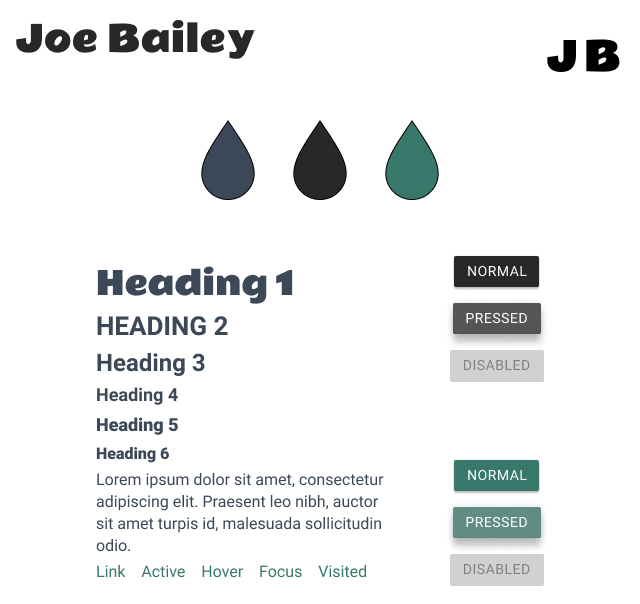

<h1 align="center">Welcome to the Joe Bailey Website repo</h1>
<p align="center">This website showcases Joe Bailey's work.</p>
<p align="center"><a href="https://joebailey.xyz">Live Site</a> <a href="https://github.com/joebailey26/joebaileyxyz">GitHub Repo</a></p>
<p align="center">
  
  <a href="https://twitter.com/joebaileyphoto" target="_blank">
    
  </a>
  <a href="https://app.netlify.com/sites/heuristic-bell-6e94b3/deploys">
    
  </a>
</p>

## Install

```sh
yarn install
```

## Development

```sh
yarn start
```

## Build

```sh
yarn build
```

## Visual Style Guide



## Coding Style Guide

### HTML

#### HTML5 Doctype

```sh
<!DOCTYPE html>
```

#### HTML Lang Attribute

```sh
<html lang=”en-GB”>
```

#### Syntax

HTML will be indented consistently by a tab character or 4 spaces.
Nested elements will be indented once.
Self closing elements need a trailing slash such as the `````` element

#### Attributes

Attributes and elements should always be lowercase
Double quotes should always be used, never single

##### Attribute Order

HTML attributes should come in this particular order for easier reading of code.
```id```
```class```
```data-*```
```for | type | href | src```

#### HTML5 Tags

HTML5 tags such as ```<header>```, ```<footer>```, ```<nav>```, and ```<time>``` are preferred over standard ```<div>``` tags.

### SCSS

CSS Files are not needed as Node Sass compiles the SCSS.

SCSS should be included in a CSS folder in the same directory as the component/element

Use one tab to indent each property

Add one blank line between code blocks

Multiple selectors can be on one line and must end with a curly brace

Property-balue pairs should be on their own line with one tab of indentation and ending in a semicolon

The closing brace should be flush left using the same amount of indentation as the opening selector

Colors should use names where possible rather than hex values

```sh
.Foo, #Bar {
  background: white;
  color: black
}

#Bar {
  width: 100%;
  height: auto;
}
```

## Git

### Commit Messages

1. Specify the type of commit:

  * feat: The new feature you're adding to a particular application

  * fix: A bug fix

  * style: Feature and updates related to styling

  * refactor: Refactoring a specific section of the codebase

  * test: Everything related to testing

  * docs: Everything related to documentation

  * chore: Regular code maintenance.

2. Separate the subject from the body with a blank line

3. Your commit message should not contain any whitespace errors

4. Remove unnecessary punctuation marks

5. Do not end the subject line with a period

6. Capitalize the subject line and each paragraph

7. Use the body to explain what changes you have made and why you made them.

8. Do not assume the reviewer understands what the original problem was, ensure you add it.

9. Do not think your code is self-explanatory

#### Command Line

```sh
git commit -m "Subject" -m "Description..."
```

#### Text Editor Template

Capitalized, short (50 chars or less) summary

More detailed explanatory text, if necessary.  Wrap it to about 72
characters or so.  In some contexts, the first line is treated as the
subject of an email and the rest of the text as the body.  The blank
line separating the summary from the body is critical (unless you omit
the body entirely).

Write your commit message in the imperative: "Fix bug" and not "Fixed bug"
or "Fixes bug."  This convention matches up with commit messages generated
by commands like git merge and git revert.

Further paragraphs come after blank lines.

- Bullet points are okay, too, use a hyphen or asterisk for the bullet, followed by a
  single space, with blank lines in between

### Branching Strategy

Master branch is for tested code and is deployed directly to **Netlify**. Do not push anything to master. Always create pull requests and test code.

Dev branch is for development work on the site. Should always contain close to production ready code requiring minimal commits to get to production status.

Branches should be created for big projects requiring more than one commit such as adding a new page. They should be titled the project name and then a pull request should be made with dev in order to test it.

## Testing

Use a local environment if possible otherwise use **Browserstack** to manually test the site by navigating to all pages and performing all actions

### List of browsers we support

* Last 2 versions of **Mozilla Firefox**
* Last 2 versions of **Microsoft Edge**
* Last 2 versions of **Google Chrome**
* Last 2 versions of **Opera**
* Last 1 versions of **Safari**
* Last 1 versions of **iOS Safari**
* Last 2 versions of **Chrome for Android**
* Last 2 versions of **Firefox for Android**
* Last 1 versions of **Samsung Internet**

## Author

👤 **Joe Bailey**

* Website: [joebailey.xyz](joebailey.xyz)
* Twitter: [@joebaileyphoto](https://twitter.com/joebaileyphoto)
* Github: [@joebailey26](https://github.com/joebailey26)
* LinkedIn: [@joe-bailey-b68b17171](https://linkedin.com/in/joe-bailey-b68b17171)
